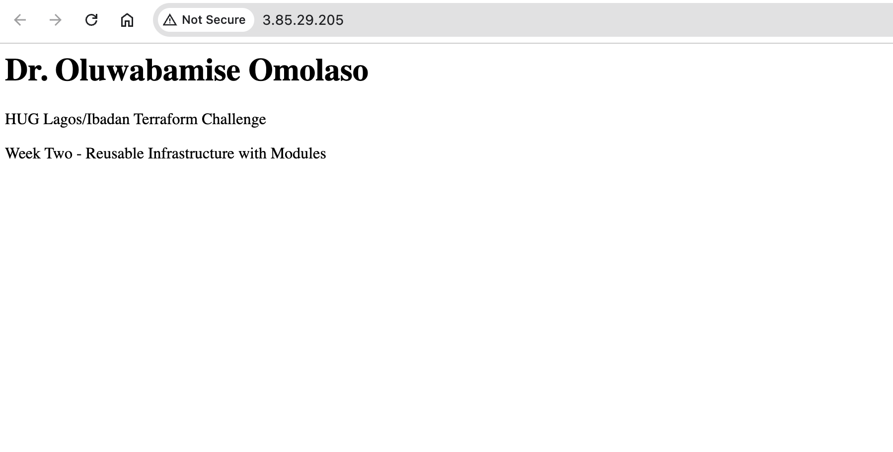
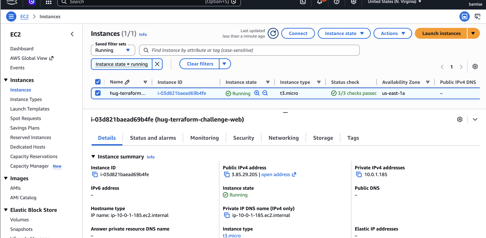

# HUG Lagos/Ibadan Terraform Challenge — Week Two

Modular refactor of Week One: reusable Terraform modules for VPC, networking, security groups, and compute, plus remote state in S3.

Same runtime outcome as Week One: a public Nginx page with your full name and **HUG Lagos/Ibadan Terraform Challenge**.

Week One (flat) reference: [hug-terraform-challenge](https://github.com/) — local path `/Users/oluwabamiseomolaso/coding_projects/hug-terraform-challenge`.

## Modules

| Module | What it creates |
|--------|-----------------|
| `modules/vpc` | Custom VPC (`10.0.0.0/16` by default) |
| `modules/networking` | Public subnet (`10.0.1.0/24`), IGW, route table (`0.0.0.0/0` → IGW), association, `map_public_ip_on_launch` |
| `modules/security_groups` | Security group: inbound SSH (22) and HTTP (80), outbound all |
| `modules/compute` | Amazon Linux 2023 AMI lookup, `t3.micro` EC2, SSH key pair (`key_name`), `user_data` (yum + Nginx + HTML) |

Root `main.tf` wires them; root `outputs.tf` exposes public IP, DNS, instance ID, and website URL.

## Prerequisites

- Terraform `>= 1.14.0` (required for S3 `use_lockfile`)
- AWS account and credentials configured locally (`aws sts get-caller-identity` should work)
- Region: default `us-east-1`
- An **EC2 key pair** already in that region (default name: `terraform-key`). Create one in the console (EC2 → Key pairs) or CLI if needed, and keep the `.pem` private key safe (never commit it). Set `key_name` in `terraform.tfvars` to match.

## Backend bootstrap (do this once, before `terraform init`)

Terraform cannot create the S3 bucket that holds its own state on first run. Create the bucket **manually** (CLI or console):

1. Create an S3 bucket with a **globally unique** name.
2. Enable **versioning**.
3. **Block all public access**.
4. Keep encryption on (SSE-S3 is fine).

Example with AWS CLI:

```bash
BUCKET="hug-tf-state-YOUR-UNIQUE-SUFFIX"
aws s3api create-bucket --bucket "$BUCKET" --region us-east-1
aws s3api put-bucket-versioning --bucket "$BUCKET" --versioning-configuration Status=Enabled
aws s3api put-public-access-block --bucket "$BUCKET" --public-access-block-configuration \
  BlockPublicAcls=true,IgnorePublicAcls=true,BlockPublicPolicy=true,RestrictPublicBuckets=true
```

Then edit `backend.tf`: replace `REPLACE_ME_WITH_YOUR_BUCKET` with your bucket name. Leave `key`, `region`, `encrypt`, and `use_lockfile` as set unless you need different values.

Docs: [S3 backend](https://developer.hashicorp.com/terraform/language/settings/backends/s3).

This project uses a **fresh** remote state (not a migration of Week One local state).

## Deploy

1. Clone the repo and `cd` into it.

2. Fill in `backend.tf` (bucket name) as above.

3. Copy example vars and edit your name if needed:

```bash
cp terraform.tfvars.example terraform.tfvars
```

`terraform.tfvars` is gitignored. Don’t commit secrets.

4. Initialize (downloads providers and configures the S3 backend):

```bash
terraform init
```

5. Review and apply:

```bash
terraform plan
terraform apply
```

Type `yes` when asked.

6. Get the URL:

```bash
terraform output website_url
```

Open that link in a browser. Wait a minute or two after apply — `user_data` still has to install Nginx on first boot.

## SSH

Amazon Linux 2023 user is `ec2-user`. Key pair name: `terraform-key`. Private key (created once): `~/.ssh/terraform-key.pem`.

After apply:

```bash
ssh -i ~/.ssh/terraform-key.pem ec2-user@$(terraform output -raw public_ip)
```

Port 22 is open on the security group; the instance uses `key_name` so your private key can authenticate. Never commit `.pem` files.

## Verify

- Browser: page shows your name and **HUG Lagos/Ibadan Terraform Challenge**
- AWS Console → EC2 → instance `hug-terraform-challenge-web` is **running**
- Optional: SSH in with the command above
- Optional: Instance diagnostics → System log — yum installing nginx and cloud-init finishing (no `scripts-user` FAILED)

**Note:** `user_data` only runs on first boot. After changing it, recreate the instance, e.g.:

```bash
terraform apply -replace=module.compute.aws_instance.ec2_instance
```

## Cleanup (save cost)

```bash
terraform destroy
```

Type `yes`. Your `.tf` files stay; run `terraform apply` again when you need screenshots or a live demo.

The state bucket itself is **not** destroyed by this stack — delete it manually later if you no longer need remote state.

## Screenshots

Put image files in the `screenshots/` folder (PNG or JPG).

### Webpage

Nginx page showing your name and **HUG Lagos/Ibadan Terraform Challenge**.



### EC2 instance running

AWS Console → EC2 → instance in **running** state.



## Challenge deliverables

- Modular Terraform code (this repo)
- Remote backend configured (S3 + `use_lockfile`)
- README with deploy steps (this file)
- Screenshot of the webpage
- Screenshot of the running EC2 instance
- LinkedIn post (thought process; tag HUG Lagos and HUG Ibadan)
